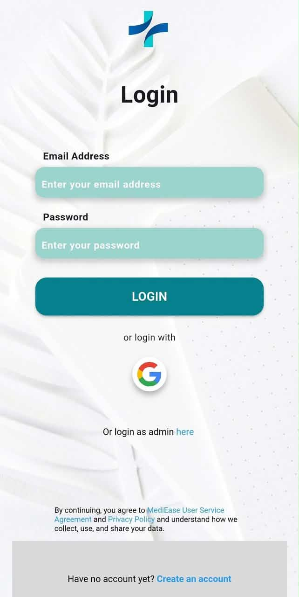
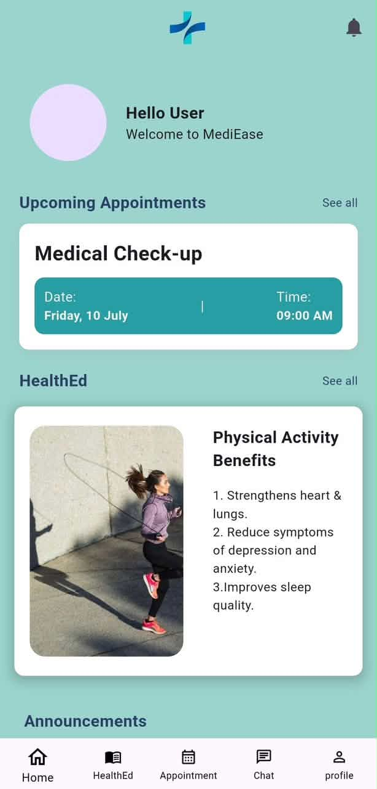
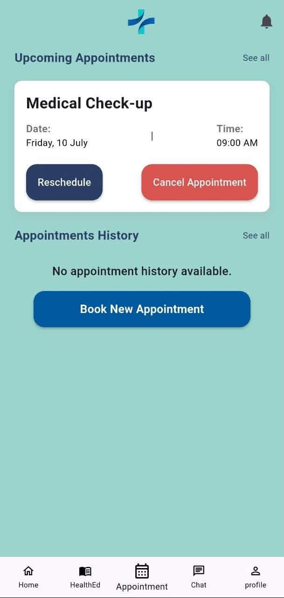
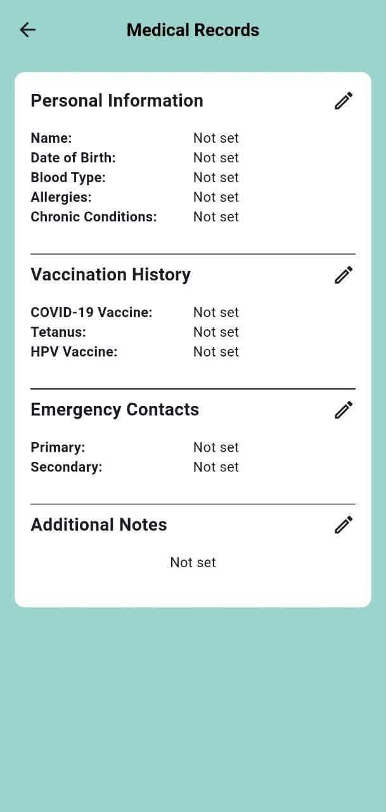
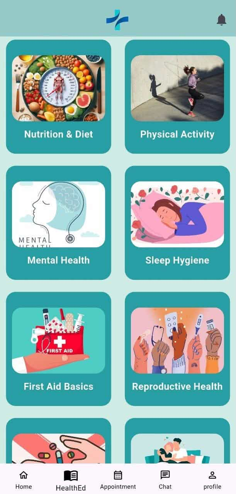
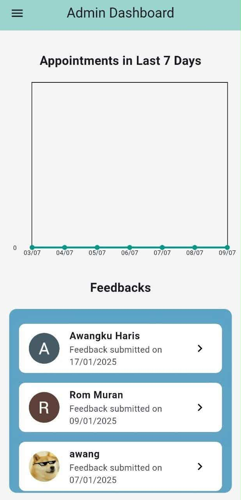
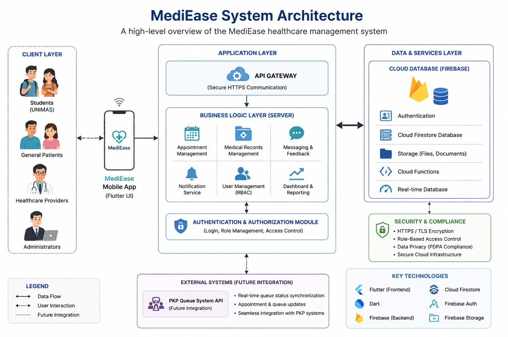

# 🏥 MediEase

> A Healthcare Appointment and Medical Record Management Mobile Application for Pusat Kesihatan Prima (PKP) UNIMAS.


---

## 📌 About MediEase

MediEase is a healthcare appointment and medical record management mobile application developed for **Pusat Kesihatan Prima (PKP) UNIMAS**. The system was designed to support healthcare service management by improving appointment scheduling, medical record access, and role-based interaction between patients, healthcare providers, and administrators.

The project focuses on creating a user-centered healthcare mobile application that helps streamline healthcare management processes and improve the patient experience.

This repository serves as a **public showcase repository** for portfolio and recruitment purposes. The complete source code is maintained in a private repository.

---

## Project Objectives

- To develop a healthcare appointment management mobile application.
- To support secure medical record access.
- To improve healthcare service management for PKP UNIMAS.
- To provide role-based access for different user types.
- To design a user-friendly mobile interface for patients, healthcare providers, and administrators.
- To support notification features for appointment-related updates.

---

## Key Features

## Patient

- Register and log in to the system
- View personal profile
- Schedule healthcare appointments
- View appointment details
- Access medical record information
- Receive appointment notifications

## Healthcare Provider

- View patient appointment requests
- Manage appointment details
- Access patient-related medical information
- Support healthcare service workflow

## Administrator

- Manage users
- Manage appointment records
- Manage healthcare service information
- Support system administration and monitoring

---

## Screenshots

## Login Page



---

## Patient Dashboard



---

## Appointment Scheduling



---

## Medical Record



---

## Healthcare Provider Dashboard



---

## Admin Dashboard



---

## System Architecture

MediEase was designed as a mobile healthcare management system with role-based access and structured healthcare service workflows.



---

## Technology Stack

| Category | Technology |
|---|---|
| Mobile Development | Flutter |
| UI/UX Design | Figma |
| Project Management | Trello |
| System Design | UML Diagrams |
| Version Control | Git & GitHub |
| Documentation | Project Documentation |

---

## Development Scope

MediEase includes the following development scope:

- Requirement analysis
- UI/UX design
- Mobile application development
- Role-based access design
- Appointment scheduling module
- Medical record access module
- Notification support
- Testing and documentation
- Client communication and project coordination

---

## My Contribution

My contributions to MediEase included:

- Project planning
- UI/UX design
- Mobile application development
- System documentation
- Testing
- Client communication
- Team coordination
- Project management

---

## Demo

A demo video of MediEase is available here:

▶️ [View Demo](DEMO.md)

---

## Installation

The complete application source code is maintained in a private repository.

This public repository is intended to showcase the project overview, documentation, screenshots, architecture diagrams, and system capabilities.

No sensitive credentials, database keys, or private implementation files are included in this repository.

---

## Source Code Access


The complete source code is **not publicly available** due to academic, privacy, and intellectual property considerations.

Recruiters, hiring managers, or academic reviewers may request temporary access to the private source code repository for evaluation purposes.

---

## Request Access

You may request access by opening a GitHub Issue using the repository access request template.

Issue title:

```text
Repository Access Request
```

Please include:

- Full Name
- Company / University
- GitHub Username
- Reason for Access

Alternatively, you may contact us directly:

📧 **ffarhanah03@gmail.com**

LinkedIn: https://www.linkedin.com/in/fatin-farhanah-415266257/

📧 **awangkuharis944@gmail.com**

LinkedIn: https://www.linkedin.com/in/awangku-haris-hakimi-bin-mohd-shafree-509695261/

---

## 🎓 Academic Information

**Project Name:** MediEase: Healthcare Appointment and Medical Record Management System App

**Client/Organization:** Pusat Kesihatan Prima (PKP) UNIMAS

**Category:** Healthcare Management System · Mobile Application Development

**University:** Universiti Malaysia Sarawak (UNIMAS)

**Programme:** Bachelor of Software Engineering with Honours

---

## ⚠️ Academic Integrity Notice

This repository is intended to showcase the MediEase project for portfolio and recruitment purposes only.

Students must not copy, reproduce, or submit any part of this project as their own academic work.

Any unauthorized reproduction, redistribution, or academic misuse is strictly prohibited.

---

## 📜 License

This repository is provided solely for portfolio and demonstration purposes.

The complete MediEase source code is maintained in a private repository.

Documentation, screenshots, diagrams, and other materials are copyrighted by the author and may not be copied, modified, redistributed, or used for commercial purposes without prior written permission.

Recruiters and hiring managers may request temporary access to the private repository for evaluation purposes.

© 2026 SupaStellar 2.0